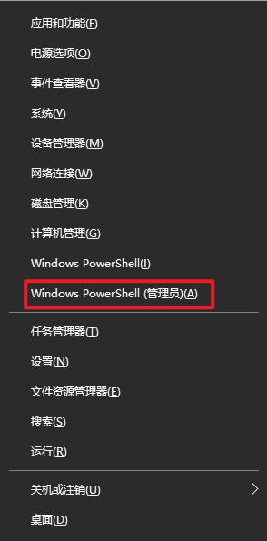
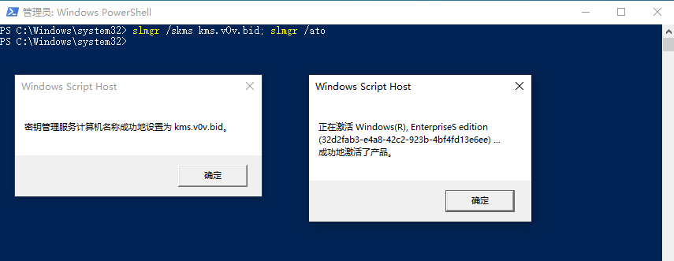
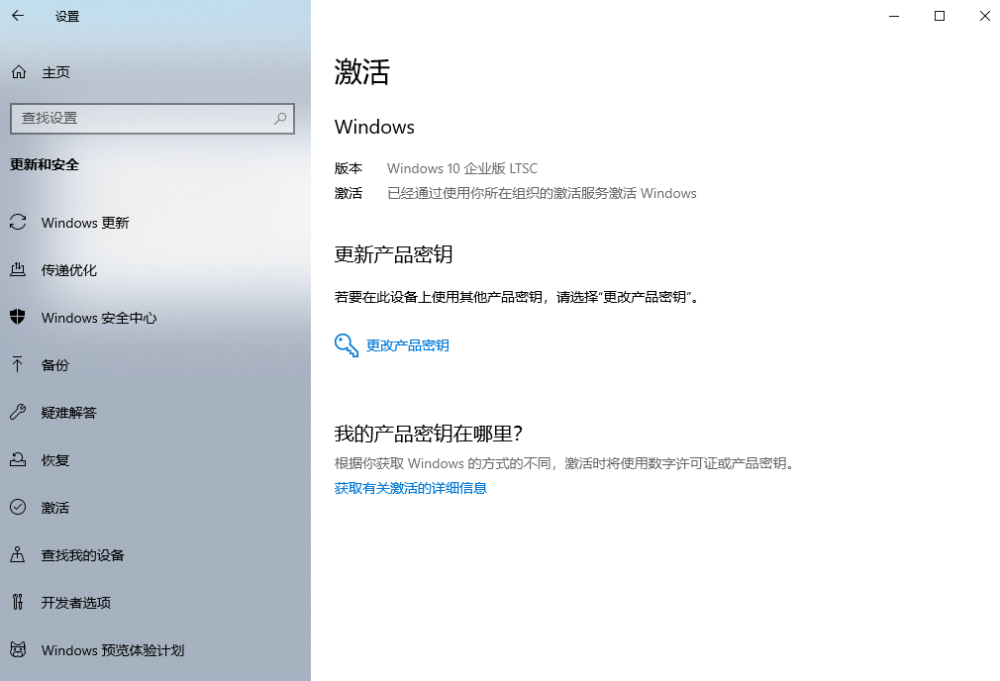

# 激活Windows

得益于 [www.v0v.bid](https://www.v0v.bid) ，我们可以通过一句命令快速激活Windows：

`slmgr /skms kms.v0v.bid; slmgr /ato`

具体做法如下：

1. 按下 `win` + `x` ， 选择 `Windows PowerShell (管理员)` 来打开具有管理员权限的 powershell 。若有 UAC 窗口弹出，请点击允许。
2. 输入 `slmgr /skms kms.v0v.bid; slmgr /ato` ，等待弹窗弹出提示则激活成功。
3. 可以通过设置查看激活情况。
